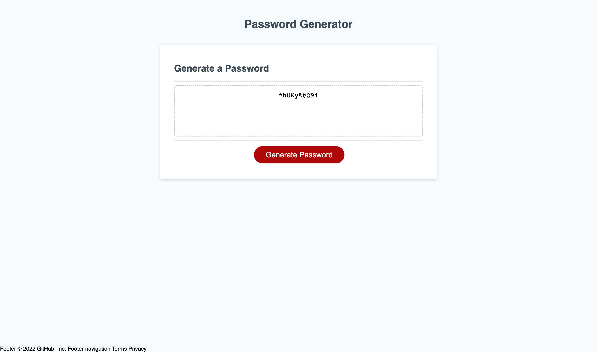

# Password assignment

## Title

Generate password challenge 3

## Project Description

* Randomly generate a password that meets certain criteria to create a strong password that provides greater security.
* When you click the button to generate a password you are presented with a series of prompts for password criteria.
* Prompted for the length of the password you can choose a length of at least 8 characters and no more than 128 characters.
* When all prompts are answered then a password is generated that matches the selected criteria.
*When the password is generated then the password is displayed written to the page.
* I used variables, function, with prompt window, confirms, random math, loop and return to generate. 

## URL link for live website

## Screenshot of product

